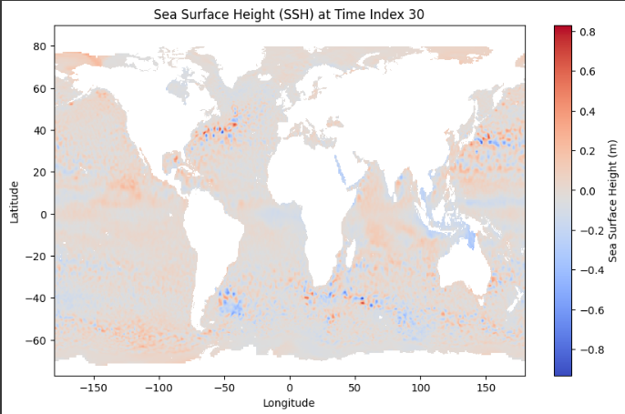
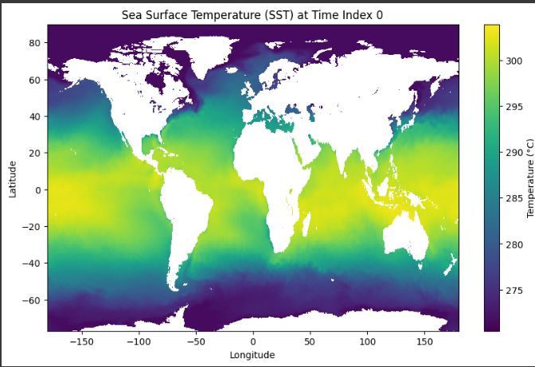
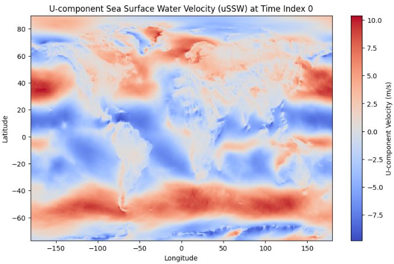
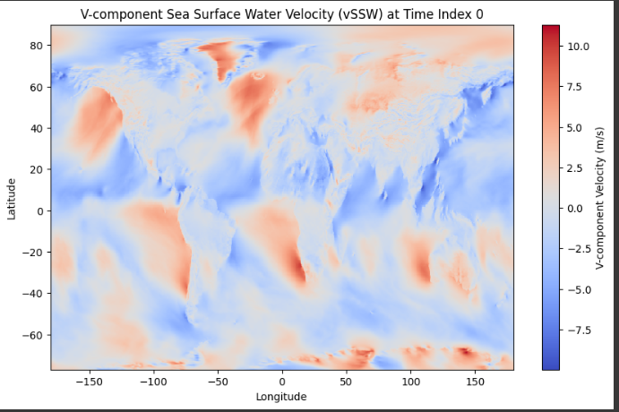

# 661-Final-Project
Deep Learning-Based Reconstruction of Sea Subsurface Temperature from Surface Climate Data

This project focuses on trying to reconstruct sea subsurface temperature (ST) from sea surface climate data using deep learning. Specifically, the input of the model will be sea surface temperature (SST), sea surface height (SSH), sea surface zonal wind (uSSW), sea surface meridional wind (vSSW), along with latitude (lat) and longitude (lon). The output of the model will be sea temperature (ST) at different depth.

<table>
  <tr>
    <td>
      <figure>
        
        <figcaption>Sea Surface Height</figcaption>
      </figure>
    </td>
    <td>
      <figure>
        
        <figcaption>Sea Surface Temperature</figcaption>
      </figure>
    </td>
  </tr>
  <tr>
    <td>
      <figure>
        
        <figcaption>Sea Surface Zonal Wind</figcaption>
      </figure>
    </td>
    <td>
      <figure>
        
        <figcaption>Sea Surface Meridional Wind</figcaption>
      </figure>
    </td>
  </tr>
</table>

We use an improvement upon LSTM fully connected layers and instead transforming them into a convolutional layer. This should improve the model’s spatial awareness because convolutional layers capture spatial hierarchy better than FC layers. Specifically, convolutional layers are more efficient in that they take advantage of spatial locality and thus have more sparse connections. The different models that we are benchmarking can be found in the 'Models' folder.

