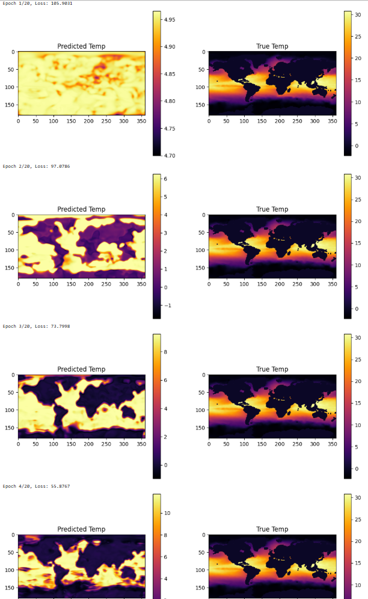

# Reconstructing Subsurface Ocean Temperatures Using Deep Convolutional Neural Networks

This project focuses on trying to reconstruct sea subsurface temperature (ST) from sea surface climate data using deep learning. Specifically, the input of the model will be sea surface temperature (SST), sea surface height (SSH), sea surface zonal wind (uSSW), sea surface meridional wind (vSSW), along with latitude (lat) and longitude (lon). The output of the model will be sea temperature (ST) at different depth.

<table>
  <tr>
    <td align="center">
       
      <strong>Sea Surface Height</strong>
    </td>
    <td align="center">
       
      <strong>Sea Surface Temperature</strong>
    </td>
  </tr>
  <tr>
    <td align="center">
       
      <strong>Sea Surface Zonal Wind</strong>
    </td>
    <td align="center">
       
      <strong>Sea Surface Meridional Wind</strong>
    </td>
  </tr>
</table>

We use an improvement upon LSTM fully connected layers and instead transforming them into a convolutional layer. This should improve the model’s spatial awareness because convolutional layers capture spatial hierarchy better than FC layers. Specifically, convolutional layers are more efficient in that they take advantage of spatial locality and thus have more sparse connections.

### Models
This section contains all the core machine learning and deep learning models used in the project. Each model is modularized into its own file within the `Models/` directory.

| File | Description |
|------|-------------|
| [Models/ConvLSTM_V1.ipynb](Models/ConvLSTM_V1.ipynb) | ConvLSTM using sigmoid and tanh activation |
| [Models/CONVLSTM_V2.ipynb](Models/ConvLSTM_V2.ipynb) | ConvLSTM using sigmoid and elu activation |
| [Models/ConvLSTM_V1_LandMasking.ipynb](Models/ConvLSTM_V1_LandMasking.ipynb) | ConvLSTM using sigmoid and tanh activation with landmasking |
| [Models/ConvLSTM_V2_LandMasking.ipynb](Models/ConvLSTM_V1_LandMasking.ipynb) | ConvLSTM using sigmoid and elu activation with landmasking |
| [Models/CNN_LSTM.ipynb](Models/CNNLSTM.ipynb) | Hybrid Architecture CNN-LSTM model |

### Additional Experimentation Files
In the main repository a couple of other files were also used for perfecting components of our model such as benchmarking hyperparameters, generating the binary 0/1 landmask, and understanding/dissecting the input datasets before use.

| File | Description |
|------|-------------|
| [ConvLSTM_Benchmarking.ipynb](ConvLSTM_Benchmarking.ipynb) | Benchmarking different hyperparameters for ConvLSTM model optimization |
| [Reading_Datasets.ipynb](Reading_Datasets.ipynb) | Extracting input, output dimensions and characteristics from each dataset |

### Example Training of Model
As each dataset is informed with longitude and latitude data, throughout the training process we can visualize the accuracy at each epoch in a 2D map format as shown below.

